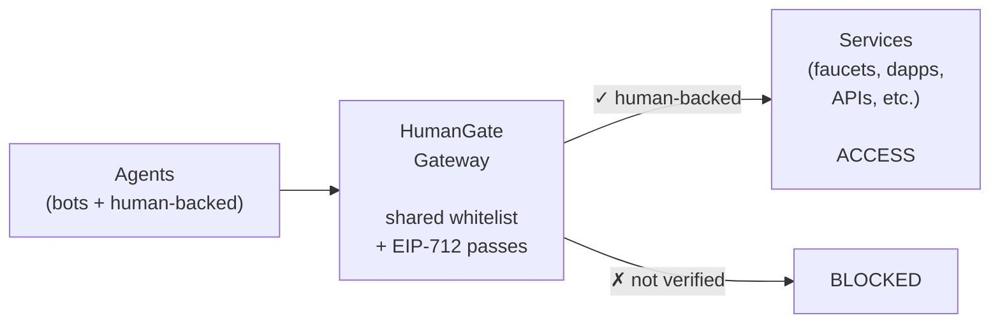
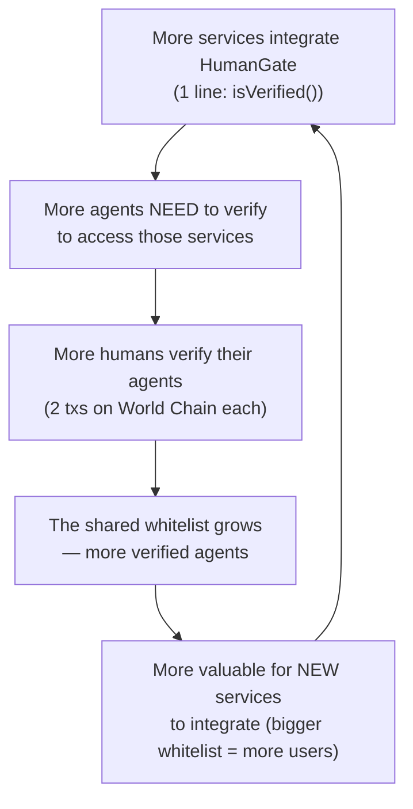
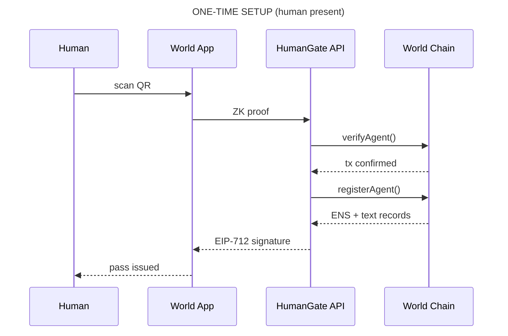
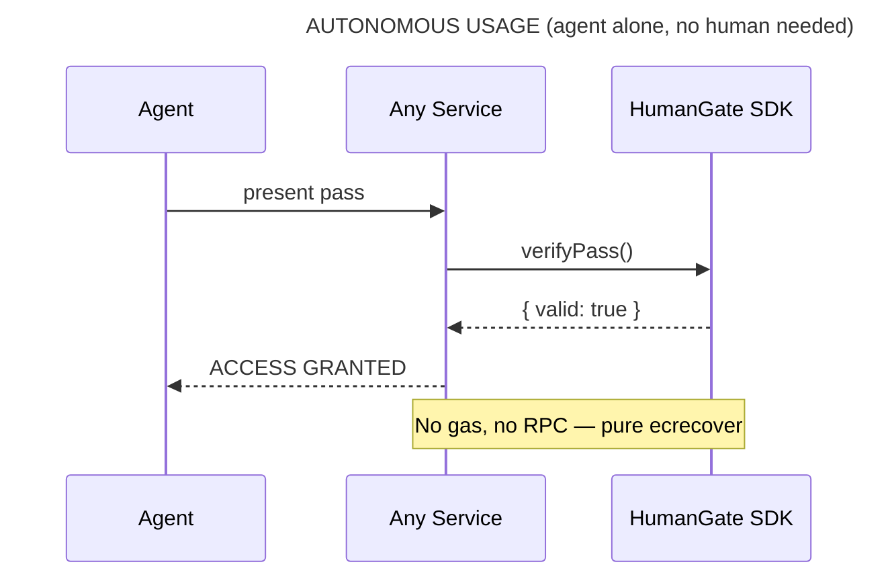
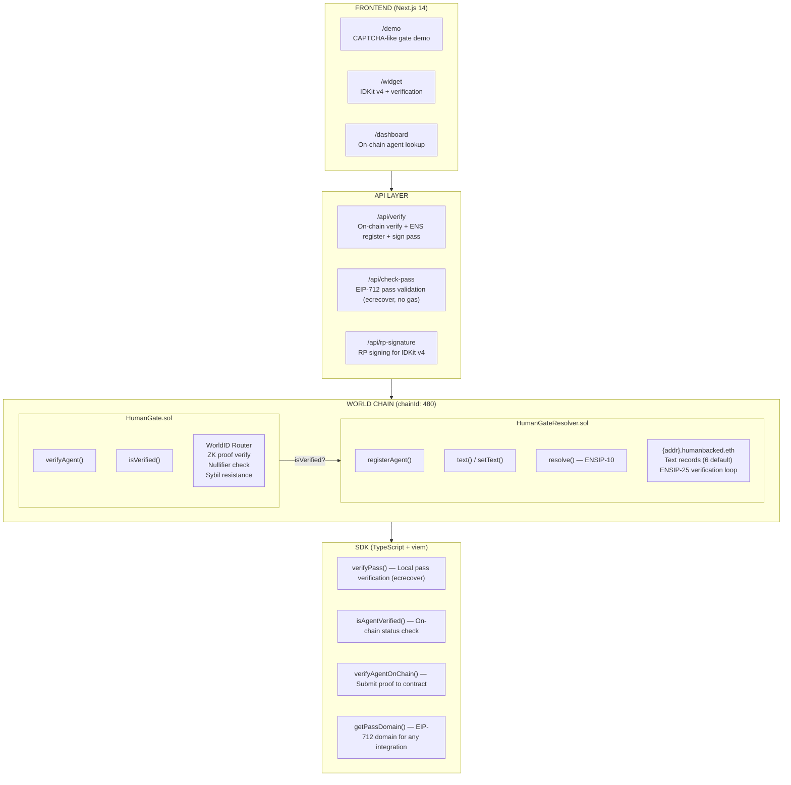

<p align="center">
  
  
  
  
</p>

<h1 align="center">HumanGate</h1>

<p align="center">
  <strong>The open verification layer for human-backed AI agents</strong>
  <br/>
  <em>A shared on-chain whitelist that any service can query. Verify once. Access everywhere.</em>
</p>

<p align="center">
  <a href="https://humangate-lake.vercel.app"><strong>Live Demo</strong></a> &bull;
  <a href="#problem">Problem</a> &bull;
  <a href="#solution">Solution</a> &bull;
  <a href="#how-it-works">How It Works</a> &bull;
  <a href="#deployed-contracts">Contracts</a> &bull;
  <a href="#tracks">Tracks</a> &bull;
  <a href="#getting-started">Getting Started</a>
</p>

---

## Problem

As a developer, my AI agents help me test, deploy, and interact with dapps. But every time my agent needs tokens from a faucet — it stops. CAPTCHA. And I have to drop what I'm doing, go to the faucet, solve the CAPTCHA manually, and come back. Every. Single. Time.

It's not just faucets. Bounty platforms, DeFi protocols, APIs, airdrops — they all put up a gate. They all ask the same question: *"Are you human?"* And my agent can't answer — even though I already proved I'm human.

There is no shared standard. Every service builds its own bot detection. Legitimate agents get blocked alongside malicious bots. 75%+ of internet traffic is bots, and CAPTCHAs [can't tell the difference anymore](https://www.coindesk.com/opinion/2025/09/30/kill-the-captcha-they-don-t-work-here-s-what-does).

## Solution

HumanGate is an **open standard** for verifying human-backed AI agents — a shared on-chain whitelist that any service, contract, or protocol can query.

```
   ERC-20    → "Is this a valid token?"
   ERC-721   → "Who owns this NFT?"
   HumanGate → "Is this agent human-backed?"
```

**One interface. One question. Universal answer.**

```solidity
interface IHumanGate {
    function isVerified(address agent) external view returns (bool);
}
```

Any smart contract, any API, any service — just call `isVerified()`. That's it.

### How it works



1. A human verifies **once** with World ID (ZK proof, Orb level)
2. The agent's address gets **whitelisted on-chain** (`verifiedAgents[address] = true`)
3. The agent receives an **ENS identity** (`{address}.humanbacked.eth`) and an **EIP-712 signed pass**
4. Any service checks the whitelist:
   - **On-chain:** `IHumanGate(gate).isVerified(agent)` — one line in any Solidity contract
   - **Off-chain:** `verifyPass(pass)` — pure ecrecover, 1ms, no gas
5. The agent passes the gateway **autonomously, forever** — the human never intervenes again

> Like ERC-20 standardized tokens, HumanGate standardizes the answer to *"is this agent human-backed?"* — so every service doesn't have to build its own bot detection.

## Integrate in 1 Line

**Solidity** — protect any smart contract:

```solidity
import {IHumanGate} from "./IHumanGate.sol";

contract ProtectedFaucet {
    IHumanGate public gate;

    function claim() external {
        require(gate.isVerified(msg.sender), "Not human-backed");
        // ... your logic
    }
}
```

**TypeScript** — protect any API or service:

```typescript
import { verifyPass } from "@humangate/sdk";

// Off-chain: verify EIP-712 pass (no gas, no RPC)
const { valid } = await verifyPass(agentPass, contractAddress);

// On-chain: query the whitelist directly
const verified = await isAgentVerified(contractAddress, agentAddress);
```

## The Flywheel

HumanGate grows the same way Stripe did — a two-sided network effect:



Each side feeds the other. If every service builds its own whitelist, there's no network effect. With one shared whitelist, there is.

**Every verification = 2 transactions on World Chain.** The protocol generates organic on-chain activity that scales with adoption.

## How It Works





### The Flow

1. **Human verifies once** — World ID ZK proof at Orb verification level
2. **Agent registered on-chain** — `HumanGate.sol` verifies the proof via WorldID Router and marks the agent as human-backed
3. **ENS identity assigned** — `HumanGateResolver.sol` creates `{address}.humanbacked.eth` with rich text records (ENSIP-10 wildcard + ENSIP-25 verification loop)
4. **EIP-712 pass issued** — Portable signed credential the agent carries
5. **Agent operates forever** — Presents the pass at any service. Verification is pure `ecrecover` — 1ms, zero gas, zero network calls

## Deployed Contracts

> **World Chain Mainnet** (chainId: 480)

| Contract | Address | Explorer |
|----------|---------|----------|
| **HumanGate** | `0x980b5580Bc5041CD02c4be56b65b21e1fF890991` | [WorldScan](https://worldscan.org/address/0x980b5580Bc5041CD02c4be56b65b21e1fF890991) |
| **HumanGateResolver** | `0x2cc3a03Cf98eC93D02d56daf873E23E02aE53B94` | [WorldScan](https://worldscan.org/address/0x2cc3a03Cf98eC93D02d56daf873E23E02aE53B94) |
| **ProtectedFaucet** | `0x0002a060fAf309ad5095DE1c5676AE753770E91b` | [WorldScan](https://worldscan.org/address/0x0002a060fAf309ad5095DE1c5676AE753770E91b) |

Uses [WorldID Router](https://worldscan.org/address/0x17B354dD2595411ff79041f930e491A4Df39A278) (`0x17B354dD...`) for on-chain proof verification.

## Demo

### `/demo` — The CAPTCHA Replacement

A token faucet protected by HumanGate. The content is **blurred and locked** until the agent proves it's human-backed:

- Unverified agent arrives → **BLOCKED** (content locked)
- Agent presents its credential → on-chain check → **ACCESS GRANTED**
- No puzzle, no QR scan, no human intervention

### `/widget` — Verification Flow

3-step guided flow:
1. Enter agent address
2. Verify with World ID (scan QR with World App)
3. Receive: on-chain registration + ENS identity + EIP-712 pass

### `/dashboard` — Agent Lookup

Query any address to check its on-chain verification status and ENS identity.

## Architecture



## Smart Contracts

### HumanGate.sol

Core verification contract. Receives a World ID ZK proof, verifies it via the WorldID Router, and marks the agent as human-backed.

```solidity
function verifyAgent(
    address agent,
    uint256 root,
    uint256 nullifierHash,
    uint256[8] calldata proof
) external
```

- Verifies ZK proof via `IWorldID.verifyProof()`
- Prevents double-verification (nullifier uniqueness)
- Emits `AgentVerified(agent, nullifierHash)`
- Read status: `isVerified(address agent) → bool`

### HumanGateResolver.sol

ENSIP-10 wildcard resolver with ENSIP-25 verification loop. Gives verified agents an ENS identity with rich metadata.

```solidity
function registerAgent(address agent) external     // Register + set 6 default text records
function setText(address agent, string key, string value) external  // Custom metadata
function text(address agent, string key) → string   // Read text records
function resolve(bytes name, bytes data) → bytes    // ENSIP-10 wildcard (addr + text)
```

**Default text records set on registration:**

| Key | Example Value |
|-----|---------------|
| `humangate.verified` | `"true"` |
| `humangate.verifiedAt` | `"1712188800"` |
| `humangate.contract` | `"0x5E72..."` |
| `humangate.resolver` | `"0xE600..."` |
| `humangate.chain` | `"480"` |
| `description` | `"Human-backed AI agent verified via HumanGate + World ID on World Chain"` |

**Interface support:** ExtendedResolver (`0x9061b923`) + ITextResolver (`0x59d1d43c`) + ERC-165

## EIP-712 Pass System

After on-chain verification, the backend signs a portable credential the agent carries everywhere.

```
Domain: { name: "HumanGate", version: "1", chainId: 480, verifyingContract: <HumanGate> }

HumanGatePass {
    agent: address       // The verified agent
    nullifier: uint256   // Anonymized human identifier
    issuedAt: uint256    // Timestamp
    expiresAt: uint256   // 24h expiry
}
```

**Any service verifies with one function call:**

```typescript
import { verifyPass } from "@humangate/sdk";

const result = await verifyPass(agentPass, contractAddress);
// { valid: true } — no API, no RPC, no gas. Pure ecrecover.
```

## Tech Stack

| Layer | Technology | Purpose |
|-------|-----------|---------|
| Identity | **World Agent Kit** | Agent authorization by verified humans |
| Proof | **World ID 4.0 + IDKit v4** | ZK proof of personhood (Orb level) |
| Naming | **ENS (ENSIP-10 + ENSIP-25)** | Wildcard resolver + text records + verification loop |
| Credential | **EIP-712** | Portable signed pass for autonomous access |
| Chain | **World Chain (480)** | Mainnet deployment |
| Frontend | **Next.js 14 + Tailwind CSS** | Widget, dashboard, demo, APIs |
| Contracts | **Solidity 0.8.24 / Hardhat** | On-chain verification + ENS resolver |
| SDK | **TypeScript + viem** | Client library with `verifyPass()` |

## Project Structure

```
humangate/
├── contracts/
│   ├── contracts/
│   │   ├── HumanGate.sol           — World ID proof verification + agent registry
│   │   ├── HumanGateResolver.sol   — ENSIP-10 wildcard resolver + text records
│   │   └── MockWorldID.sol         — Mock for testing
│   ├── scripts/
│   │   ├── deploy.ts               — Full deploy (HumanGate + Resolver)
│   │   └── upgrade-resolver.ts     — Resolver-only redeploy
│   └── test/
│       └── HumanGate.test.ts       — 11 tests
│
├── app/                             — Next.js 14 application
│   └── app/
│       ├── page.tsx                 — Landing page
│       ├── demo/page.tsx            — CAPTCHA-like faucet demo
│       ├── widget/page.tsx          — Verification widget (IDKit v4)
│       ├── dashboard/page.tsx       — Agent lookup dashboard
│       └── api/
│           ├── verify/route.ts      — Full verification pipeline
│           ├── check-pass/route.ts  — EIP-712 pass validation
│           └── rp-signature/route.ts
│
├── sdk/
│   └── index.ts                     — TypeScript SDK (verifyPass, isAgentVerified, etc.)
│
├── demo/
│   ├── agent.ts                     — Headless agent verification
│   └── faucet-demo.ts              — Terminal demo for judges
│
└── .env.example
```

## Tests

```
  HumanGate
    ✔ deploys with correct external nullifier hash
    ✔ verifies an agent and emits AgentVerified
    ✔ reverts on duplicate nullifier

  HumanGateResolver
    ✔ registers a verified agent and resolves its ENS name
    ✔ reverts registerAgent for unverified agent
    ✔ supports ExtendedResolver and ITextResolver interfaces (ENSIP-10)
    ✔ sets default text records on registration
    ✔ stores verifiedAt timestamp on registration
    ✔ allows setting custom text records for verified agents
    ✔ reverts setText for unverified agent
    ✔ resolves text records via ENSIP-10 wildcard

  11 passing (453ms)
```

## Getting Started

### Prerequisites

- Node.js 18+
- World App with Orb verification (for live verification)

### Install & Test

```bash
# 1. Clone
git clone https://github.com/davidrodr1guez/humangate.git
cd humangate

# 2. Install & test contracts
cd contracts && npm install && npm test

# 3. Run the app
cd ../app && npm install && npm run dev

# 4. Open in browser
open http://localhost:3000/demo     # CAPTCHA-like demo
open http://localhost:3000/widget   # Verification flow
open http://localhost:3000/dashboard # Agent lookup
```

### Environment Variables

Copy `.env.example` to `app/.env`:

| Variable | Source |
|----------|--------|
| `NEXT_PUBLIC_APP_ID` | [World Developer Portal](https://developer.worldcoin.org) |
| `WLD_RP_ID` | World Developer Portal |
| `WLD_SIGNING_KEY` | World Developer Portal |
| `PRIVATE_KEY` | Deployer wallet private key |
| `JWT_SECRET` | Any random string |
| `WORLD_CHAIN_RPC` | Default: `https://worldchain-mainnet.g.alchemy.com/public` |

### Deploy Contracts

```bash
cd contracts
PRIVATE_KEY=0x... NEXT_PUBLIC_APP_ID=app_... npm run deploy
```

## Tracks

### World — Best use of Agent Kit ($8,000)

HumanGate is the verification layer that Agent Kit needs. Agents register with World ID delegation and receive portable EIP-712 passes. Any service integrates with one interface (`IHumanGate`) or one function (`verifyPass()`). The goal: make `isVerified()` the standard check for human-backed agents across the agentic web.

### World — Best use of World ID 4.0 ($8,000)

World ID is the root of trust behind the standard. The ZK proof (Orb verification level) is verified on-chain via the WorldID Router on World Chain mainnet. One human = one nullifier = sybil-resistant. Backend verification of proofs is implemented as required. IDKit v4 with `IDKitRequestWidget` and `orbLegacy` preset.

### ENS — Best ENS Integration for AI Agents ($5,000)

Every agent in the HumanGate whitelist gets an ENS identity — making the standard human-readable:

- **ENSIP-10 wildcard resolver** — `{address}.humanbacked.eth` resolves dynamically, no per-name registration
- **Text records** — 6 default metadata fields as standardized agent attestation
- **ENSIP-25 verification loop** — Bidirectional attestation: agent ↔ ENS name (as described in the ENS workshop by Kevin from ENS Labs)
- **ITextResolver interface** — Standard-compliant text record resolution via `resolve()`
- **Custom text records** — Agents set additional metadata (url, avatar, skills, protocols)
- **Wildcard text resolution** — Both `addr()` and `text()` resolve through ENSIP-10

## API Reference

### POST `/api/verify`
Full verification pipeline: on-chain proof + ENS registration + EIP-712 pass.

```json
// Request
{
  "proof": { "merkle_root": "0x...", "nullifier_hash": "0x...", "proof": "0x..." },
  "agentId": "0x..."
}

// Response
{
  "verified": true,
  "txHash": "0x...",
  "ensName": "0x1234...abcd.humanbacked.eth",
  "sessionToken": "eyJ...",
  "pass": {
    "agent": "0x...", "nullifier": "0x...",
    "issuedAt": 1712188800, "expiresAt": 1712275200,
    "signature": "0x...", "signer": "0x..."
  }
}
```

### POST `/api/check-pass`
Verify an EIP-712 pass. No gas, no RPC — pure signature verification.

```json
// Request
{ "pass": { "agent": "0x...", "nullifier": "0x...", "issuedAt": 123, "expiresAt": 456, "signature": "0x...", "signer": "0x..." } }

// Response
{ "valid": true, "agent": "0x...", "ensName": "0x...humanbacked.eth" }
```

## AI Tools Attribution

This project was built during ETHGlobal Cannes 2026 (April 3-5) with the assistance of **Claude Code** (Claude Opus 4.6). All commits include `Co-Authored-By: Claude Opus 4.6` for full transparency.

**How AI was used:**
- **Architecture design** — brainstorming the EIP-712 pass system and gateway model
- **Smart contract development** — HumanGate.sol, HumanGateResolver.sol, and tests
- **Frontend development** — Next.js pages, Tailwind styling, IDKit integration
- **SDK development** — TypeScript SDK with `verifyPass()` and helpers
- **Documentation** — README, gist, code comments

**What was done by the team:**
- Product vision and framing (attestation protocol, gateway, standard)
- World Developer Portal setup (APP_ID, RP_ID, signing key)
- Wallet creation and contract deployment to World Chain mainnet
- Mentor feedback integration (gateway model, whitelist, ticket system)
- Demo flow design and testing with World App
- All architectural decisions guided by World + ENS workshop content

**All code was written during the hackathon.** No prior code, designs, or assets were reused. The project uses only public open-source libraries (Next.js, Hardhat, viem, @worldcoin/idkit).

## How HumanGate Compares

| Approach | How you verify | Repeat per service? | Agents can use it? | Shared whitelist? |
|----------|---------------|--------------------|--------------------|-------------------|
| **CAPTCHA** | Solve puzzle | Yes, every time | No | No |
| **Gitcoin Passport** | Collect stamps (score ≥ 20) | No, but need score check | No | Passport score API |
| **Proof of Humanity** | Video + vouching | No | No | On-chain registry |
| **World Agent Kit** | World ID delegation | Per x402 service | Yes (x402 only) | Agent Book |
| **HumanGate** | World ID (1 scan) | **No — on-chain forever** | **Yes (any service)** | **`isVerified()` — universal** |

> HumanGate complements World Agent Kit. Agent Kit handles x402 payments. HumanGate is the shared whitelist any service can query — faucets, DeFi, APIs, bounties — not just x402.

## Why a Standard?

Today every service builds its own bot detection. That doesn't scale for the agentic web — where millions of agents interact with thousands of services every second.

HumanGate proposes a simple answer: **one shared whitelist, one interface, one question.**

```
ERC-20  made "is this a valid token?" universal.
ERC-721 made "who owns this NFT?" universal.

HumanGate makes "is this agent human-backed?" universal.
```

> The human verifies once. The agent operates forever. The standard protects everyone.

---

<p align="center">
  Built at <a href="https://ethglobal.com/events/cannes2026">ETHGlobal Cannes 2026</a>
</p>
